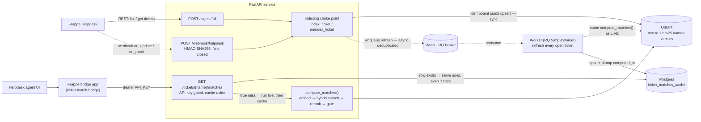

# Ticket Match RAG

A retrieval service that surfaces similar past resolved helpdesk tickets — with the fix that
solved them — to an agent working a new ticket. Retrieval only: hybrid search → rerank → gate →
surface. No answer generation, so no hallucination-grounding problem; the hard problem here is
ranking quality.

## What It Does

An agent opens a ticket in Frappe Helpdesk; a "Similar Tickets" panel shows the closest past
Reusable Tickets, each with its Resolution Summary inline. Each row below exercises a different
part of the pipeline:

| Capability | Example |
|---|---|
| Lexical match (BM25 leg) | Query ticket *"VPN disconnects immediately after macOS update"* surfaces *"GlobalProtect drops with 'network unreachable' after the latest OS patch"* |
| Semantic match, low lexical overlap (dense leg carries it alone) | *"corporate network client stops working every time a system patch lands"* still surfaces the VPN-crash cluster, with almost no shared vocabulary |
| Precision gate (cross-encoder + Match Threshold) | *"VPN takes 5+ minutes to establish a connection after the update"* reuses the VPN cluster's trigger words but describes a different failure mode — it is **not** shown |
| Grounded refusal (no filler) | when nothing clears the threshold the panel shows fewer than five Matches, or none — never a low-confidence Match just to fill the row |
| Resolution surfaced directly | every Match carries its Resolution Summary, so the agent never opens the original ticket to find the fix |
| Incremental indexing | a ticket gains a `resolution_details` value → Frappe webhook → indexed and eligible as a Match within one background refresh sweep |

See [CONTEXT.md](CONTEXT.md) for the domain model (Ticket, Match, Root-Cause Similarity, Match
Threshold, Duplicate Cluster, Distractor).

## Architecture



The subgraph is execution order, not code layout. **Every Qdrant mutation goes through one choke
point** (`retrieval/indexing.py`), which also enqueues a background refresh of the Postgres Match
cache. **Reads are cache-aside**: a `GET /tickets/{name}/matches` request is served from the cache
whenever a row exists — no freshness check, staleness accepted (ADR 0007) — and only runs the live
`embed → hybrid search → rerank → gate` pipeline on a true miss. The RQ worker keeps cached rows
current by recomputing Matches for *every* open ticket on each corpus change (a newly-resolved
ticket can become a better Match for any open ticket, so it is a full sweep, not targeted
invalidation), using the exact same `compute_matches()` the live path uses.

The one consumer of the API is Helpdesk's own agent ticket view, via a small Frappe app
([`ticket-match-bridge`](https://github.com/arunjoyt/ticket-match-bridge), ADR 0006/0008) that
overrides Helpdesk's stubbed `get_recent_similar_tickets()`. See [docs/ARCHITECTURE.md](docs/ARCHITECTURE.md)
for the full data flow and [docs/PERFORMANCE.md](docs/PERFORMANCE.md) for measured latency under load.

## Tech Stack

| Layer | Technology |
|---|---|
| Helpdesk | Frappe Helpdesk (REST API + Webhooks) — no bench dependency, pulled over HTTP |
| Vector DB | Qdrant (self-hosted) — dense + BM25 sparse named vectors, server-side RRF fusion (ADR 0002) |
| Orchestration | Hand-rolled (`retrieval/matching.py`) — no LangChain, no chunking (a ticket embeds whole) |
| Embeddings | `EMBEDDING_MODEL`, default `BAAI/bge-small-en-v1.5` (local sentence-transformers) — see `config.py` |
| Sparse | `SPARSE_MODEL`, default `Qdrant/bm25` (fastembed) — asymmetric doc/query encode |
| Re-ranker | `RERANK_MODEL`, default `cross-encoder/stsb-roberta-base` — sentence-pair semantic equivalence, chosen over an ms-marco cross-encoder (ADR 0004) |
| LLM | **none** — retrieve-and-surface, no generation step anywhere |
| Match cache | Postgres (`ticket_matches_cache`) — ADR 0006/0007 |
| Background compute | RQ (`SimpleWorker`, models stay resident) on Redis |
| Evaluation | `ranx` — recall@20 / precision@5 / MRR / nDCG@5, sliced by query variant (ADR 0003) |
| API | FastAPI, single shared API key (`Authorization: Bearer`, ADR 0009) |
| Helpdesk UI | Frappe bridge app overriding `get_recent_similar_tickets()` + one Vue snippet edit |
| Infra | Docker Compose + Nginx (envsubst template) |

## Project Structure

```
ticket-match-rag/
├── ingestion/
│   ├── helpdesk_client.py       # Frappe Helpdesk REST client (token auth)
│   ├── embedder.py              # Dense + sparse (BM25) embedding; match_text() = subject + description
│   └── webhook_handler.py       # POST /webhook/helpdesk — HMAC-SHA256 verify, incremental re-index
├── retrieval/
│   ├── vector_store.py          # Qdrant collection, upsert, delete, RRF fusion query
│   ├── hybrid_search.py         # Dense + sparse fused candidate pool
│   ├── reranker.py              # Cross-encoder rerank, returns scores (Match Threshold gates on them)
│   ├── matching.py              # Shared embed → search → rerank → gate pipeline + object graph
│   └── indexing.py              # index_ticket() / deindex_ticket() — the one Qdrant-mutation choke point
├── api/
│   ├── main.py                  # FastAPI app: /health, /ingest/full, /tickets/{name}/matches, webhook router
│   └── auth.py                  # require_api_key — single shared key, hmac.compare_digest, fails closed
├── worker/
│   ├── tasks.py                 # refresh_all_open_tickets_cache() — full sweep on every corpus change
│   └── run.py                   # RQ SimpleWorker entry point (models stay loaded across jobs)
├── db/
│   ├── cache.py                 # MatchCache — Postgres get/put/delete
│   └── schema.sql               # ticket_matches_cache (ticket_name PK, matches JSONB, computed_at)
├── eval/
│   ├── dataset.py               # Builds queries / qrels / near-miss lookups from data/seed_manifest.json
│   └── run.py                   # ranx runner — retrieval-stage vs. final-stage metrics + distractor leakage
├── scripts/
│   ├── seed_helpdesk.py         # Seeds synthetic Duplicate Clusters + Distractors, writes seed_manifest.json
│   ├── calibrate_threshold.py   # Sweeps MATCH_THRESHOLD, optimizes F0.5 against the seeded score distribution
│   ├── register_webhook.py      # Registers the two Frappe Webhook records (on_update, on_trash)
│   └── stress_test.py           # Latency / concurrency / worker-sweep projection (docs/PERFORMANCE.md)
├── frappe_bridge/
│   ├── README.md                # Where the bridge app lives (its own repo) and why
│   └── helpdesk-vue-patch/      # Durable copy of the two hand-edited Helpdesk Vue files
├── data/
│   ├── seed_manifest.json       # Ground truth: ticket → cluster, variant, distractor kind (local dev)
│   └── seed_manifest.prod.json  # Same, for the production seed run
├── docs/
│   ├── ARCHITECTURE.md          # System design and data flow (as implemented)
│   ├── PERFORMANCE.md           # Reproducible latency & concurrency methodology
│   ├── PERFORMANCE_SUMMARY.md   # Evaluator-facing "does this fit?" summary
│   ├── DEPLOYMENT.md            # Executed production reference (Part B — AWS EC2)
│   ├── DEPLOYMENT_PLAN.md       # The plan that preceded DEPLOYMENT.md (Part A — Helpdesk on Contabo)
│   ├── PROPOSED_ARCHITECTURE.md # Retired stub — everything it proposed is now built
│   └── adr/                     # 0001–0010 — decision record, history not living docs
├── nginx/
│   ├── nginx.conf               # Base reverse-proxy config
│   └── templates/
│       └── ticket-match-rag.conf.template  # envsubst template for API_DOMAIN
├── config.py                    # Central env-var config — model names, MATCH_THRESHOLD, URLs, secrets
├── docker-compose.yml           # Base infra: qdrant, postgres, redis (all loopback-bound)
├── docker-compose.prod.yml      # Production overlay: adds app, worker, nginx + restart policies
├── Dockerfile
├── requirements.txt
├── .env.example
└── .gitignore
```

## Quick Start (local development)

Prerequisites: a local Frappe Helpdesk instance (Docker), Docker Compose, and [uv](https://docs.astral.sh/uv/).

1. Copy `.env.example` to `.env`. For local dev the defaults work; fill in `HELPDESK_API_KEY` /
   `HELPDESK_API_SECRET` (generate a key for a Helpdesk user), and set `WEBHOOK_SECRET` and
   `API_KEY` to random values (`openssl rand -hex 32`).
2. Start infrastructure:
   ```bash
   docker compose up -d          # qdrant, postgres, redis
   ```
3. Create the venv and install dependencies:
   ```bash
   uv venv && uv pip install -r requirements.txt
   ```
4. Start the API and the worker (separate shells):
   ```bash
   uv run uvicorn api.main:app --reload
   uv run python -m worker.run
   ```
5. Seed the Helpdesk instance and run a full ingest:
   ```bash
   uv run python scripts/seed_helpdesk.py
   curl -X POST http://localhost:8000/ingest/full -H "Authorization: Bearer $API_KEY"
   ```
6. Register the incremental-sync webhooks (optional for a first look):
   ```bash
   uv run python scripts/register_webhook.py
   ```
7. Query a known ticket:
   ```bash
   curl http://localhost:8000/tickets/<ticket-name>/matches -H "Authorization: Bearer $API_KEY"
   ```
   Confirm the response matches a Duplicate Cluster from `data/seed_manifest.json`.

To see it inside Helpdesk's own agent UI, install the bridge app
([`ticket-match-bridge`](https://github.com/arunjoyt/ticket-match-bridge)) on the Helpdesk bench
and apply the Vue snippet from `frappe_bridge/helpdesk-vue-patch/` — see
[docs/ARCHITECTURE.md](docs/ARCHITECTURE.md) § Helpdesk-native UI.

## Production Deployment

`ticket-match-rag` runs on its own AWS EC2 instance; the Helpdesk instance it reads from is a
separate host. [docs/DEPLOYMENT.md](docs/DEPLOYMENT.md) is the executed step-by-step reference. The
short version:

1. Provision a `t3.medium` (Ubuntu 22.04), Elastic IP, security group open on 22/80/443 only.
2. Point `ticket-match.<domain>` at the Elastic IP; provision a TLS cert with `certbot certonly --standalone`.
3. Fill `.env` on the box — `HELPDESK_URL` + key/secret, `WEBHOOK_SECRET` (must match Helpdesk's
   Webhook records), `API_KEY`, and `API_DOMAIN=ticket-match.<domain>` (bare hostname — substituted
   into nginx's config at container start).
4. Launch:
   ```bash
   docker compose -f docker-compose.yml -f docker-compose.prod.yml up -d
   ```
   Only nginx binds public ports (80/443); qdrant/postgres/redis stay loopback-only.
5. Run the initial full ingest (`POST /ingest/full`) — webhooks only cover changes made after
   they are registered.

## Environment Variables

See `.env.example` for the full list. Key groups:

| Group | Variables | Purpose |
|---|---|---|
| Helpdesk | `HELPDESK_URL`, `HELPDESK_API_KEY`, `HELPDESK_API_SECRET` | Frappe Helpdesk REST access (token auth) |
| Webhook | `WEBHOOK_SECRET` | HMAC-SHA256 signature verification on `/webhook/helpdesk` — fails closed if unset |
| API auth | `API_KEY` | Single shared key for `/ingest/full` and `/tickets/{name}/matches` (ADR 0009) — fails closed if unset |
| Qdrant | `QDRANT_URL`, `QDRANT_COLLECTION` | Vector store |
| Cache / broker | `DATABASE_URL`, `REDIS_URL` | Postgres Match cache and RQ broker |
| Models | `EMBEDDING_MODEL`, `RERANK_MODEL`, `SPARSE_MODEL` | Local models, loaded in-process; defaults in `config.py` |
| Match Threshold | `MATCH_THRESHOLD` | Reranker-score gate; calibrated per model + corpus (`scripts/calibrate_threshold.py`) — meaningless for a different `RERANK_MODEL` |
| Webhook target | `API_WEBHOOK_URL` | Where `scripts/register_webhook.py` points Helpdesk (local dev: `host.docker.internal`) |
| Production | `API_DOMAIN` | Bare hostname, drives the nginx template (`docker-compose.prod.yml` only) |

## Data Sources

| Doctype | Indexing | Notes |
|---|---|---|
| HD Ticket (Reusable Ticket) | Whole record, no chunking | Eligible once `resolution_details` is non-empty, independent of `status` (ADR 0001) |

The match vector is built from `subject + description` only (`match_text()` in
`ingestion/embedder.py`) — problem-to-problem matching. The Resolution Summary is stored and shown
alongside a Match but is never embedded (CONTEXT.md: Match).

## Incremental Indexing

`scripts/register_webhook.py` registers two Frappe Webhooks on HD Ticket — `on_update` and
`on_trash` (Frappe's `webhook_docevent` is single-select, so one record can't cover both). The
`/webhook/helpdesk` endpoint:

1. Verifies the HMAC-SHA256 signature (`X-Frappe-Webhook-Signature`), failing closed if `WEBHOOK_SECRET` is unset.
2. Refetches the full ticket via the Helpdesk REST API.
3. Re-indexes it if still eligible (non-empty `resolution_details`), or deletes its Qdrant point if it was trashed or made ineligible.
4. Enqueues a deduplicated Match-cache refresh — a burst of events collapses into one pending sweep.

## Evaluation

```bash
uv run python -m eval.run
```

Runs `ranx` IR metrics against `data/seed_manifest.json` — synthetic Duplicate Clusters (hold out
one member as the Query Ticket, check whether its siblings surface in the top-k) plus Distractors
seeded to be topically adjacent but not Root-Cause Similar (ADR 0003). Two stages are reported
separately so the breakdown shows which part of the pipeline is doing the work:

- **Retrieval stage** — `recall@20` on the fused dense+sparse candidate pool (a ceiling check: a relevant ticket missing from the pool can't be recovered by reranking).
- **Final stage** — `precision@5`, `MRR`, `nDCG@5` on the post-rerank ranking (what an agent actually sees, modulo the Match Threshold).

Each stage is sliced `overall` / `standard` / `low-lexical-overlap`, plus a near-miss distractor
leakage check (how often a hard negative clears the Match Threshold). This is a **manual local
run**, not CI — it needs a fully-seeded and ingested corpus first (`scripts/seed_helpdesk.py`,
then `POST /ingest/full`). `scripts/calibrate_threshold.py` re-picks `MATCH_THRESHOLD` against the
same corpus, optimizing F0.5 (precision-weighted, per CONTEXT.md's bias against low-confidence Matches).

## Performance

Measured, not estimated — see [docs/PERFORMANCE_SUMMARY.md](docs/PERFORMANCE_SUMMARY.md) for the
evaluator-facing view and [docs/PERFORMANCE.md](docs/PERFORMANCE.md) for methodology
(`scripts/stress_test.py`).

| Path | Time |
|---|---|
| Repeat lookup (cached row) | ~10 ms |
| First-time lookup (live pipeline) | ~0.3–0.6 s — ~90% in the cross-encoder rerank |
| Worker re-score | ~40 ms per ticket |

The service runs as one process by default; a cache-miss request blocks it for the full pipeline
duration (`requests`, `sentence-transformers`, `qdrant-client`, `psycopg2` are all synchronous —
`async def` is a FastAPI convention here, not concurrency). In normal use the background sweep keeps
recently active tickets pre-scored, so most agent traffic hits the fast path. Tested against a
67-ticket corpus on an M1 laptop — a small validation run, not a production-scale test.
