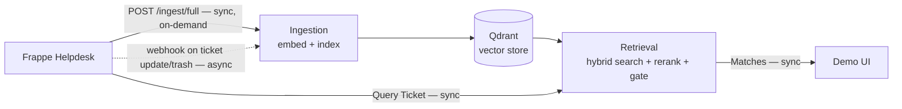
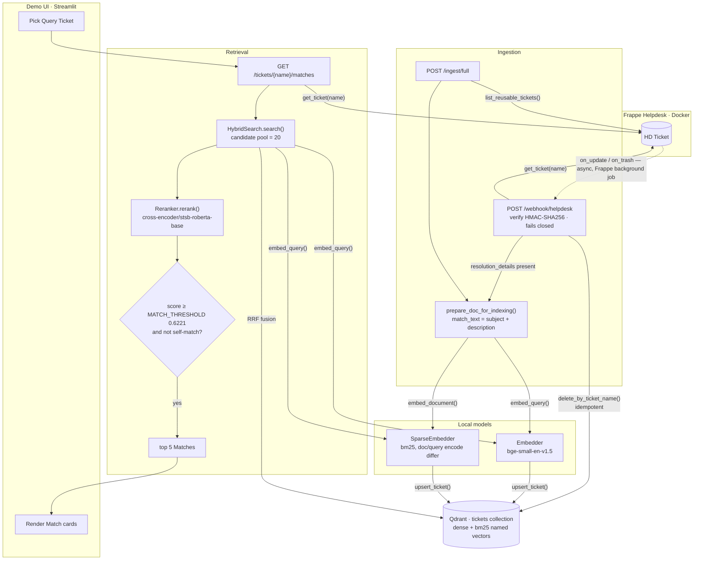

# Architecture

This document shows the pipeline as it is implemented today. See [CONTEXT.md](../CONTEXT.md) for the domain model (Ticket, Match, Match Threshold, and so on) and the `docs/adr/` directory for the decisions behind each part. See [PROPOSED_ARCHITECTURE.md](PROPOSED_ARCHITECTURE.md) for the background-compute redesign in ADR 0006, not yet implemented.

## Overview

The system has two independent inputs that write to one vector store, and one read path that queries it.

Solid arrows are synchronous: the caller blocks until it gets a response. The dashed arrow is the one asynchronous boundary in the whole system — Frappe queues webhook delivery on its own background job, decoupled from the request that saved the ticket, so the agent editing a ticket never waits on indexing. Everything downstream of that webhook hop, and the full-sync and retrieval paths end to end, run synchronously.

Ingestion keeps the index current. Retrieval never writes to it — a request only reads. There is no generation step anywhere in the pipeline. A Match is a past Ticket Record surfaced as-is, not a generated answer.

## Pipeline

Solid arrows are synchronous calls — each one blocks until it returns. The one dashed arrow, `HD Ticket -> POST /webhook/helpdesk`, is asynchronous: Frappe dispatches webhook delivery on its own background job, so saving a ticket in Helpdesk does not wait on this service's indexing. Once that POST lands, everything inside the handler runs synchronously again.

Note that every route in `api/main.py` is declared `async def`, but almost none of them `await` anything — `requests`, `sentence-transformers`, and `qdrant-client` are all synchronous libraries. So a request to `/tickets/{name}/matches` blocks the process for its full duration (embed, search, rerank) rather than yielding to other work. `async def` here is a FastAPI convention, not a concurrency guarantee.

### Ingestion

Two entry points write to the same index. `POST /ingest/full` (`api/main.py`) walks every Reusable Ticket. A ticket is eligible once `resolution_details` is non-empty, independent of the `status` field (ADR 0001).

`POST /webhook/helpdesk` (`ingestion/webhook_handler.py`) keeps the index current between full syncs. Frappe fires `on_update` and `on_trash` on the HD Ticket doctype. The handler verifies an HMAC-SHA256 signature and fails closed if `WEBHOOK_SECRET` is unset. It refetches the ticket, deletes the existing point, and re-indexes only if the ticket is still eligible.

`match_text()` (`ingestion/embedder.py`) is the one place title and description join into the text that gets embedded. The Resolution Summary is never part of the match vector. It is only shown alongside a Match.

Point IDs are deterministic — `uuid5` of the ticket name. Every upsert overwrites the same point, so indexing stays idempotent.

### Retrieval and the gate

A query embeds the same way a document does, both dense and sparse. Qdrant fuses the two candidate sets with RRF fusion before the cross-encoder sees them (`retrieval/vector_store.py`). Fusion rank builds the candidate pool. It is not a cross-query-comparable confidence value.

The Match Threshold gates on the reranker's score instead (`retrieval/reranker.py`, `config.py`). The threshold is calibrated against the seeded corpus, optimizing F0.5 (`scripts/calibrate_threshold.py`). Below the threshold, the panel shows fewer than five Matches, or none. It never shows a low-confidence Match just to fill the row.

## Key files

| Concern | File |
| --- | --- |
| API routes, app lifecycle | `api/main.py` |
| Helpdesk REST client | `ingestion/helpdesk_client.py` |
| Dense + sparse embedding, `match_text()` | `ingestion/embedder.py` |
| Webhook signature check, incremental re-index | `ingestion/webhook_handler.py` |
| Dense + sparse fusion query | `retrieval/hybrid_search.py` |
| Qdrant collection, upsert, delete | `retrieval/vector_store.py` |
| Cross-encoder rerank | `retrieval/reranker.py` |
| Demo UI | `ui/app.py` |
| Model names, Match Threshold, URLs | `config.py` |
