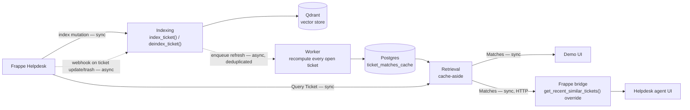
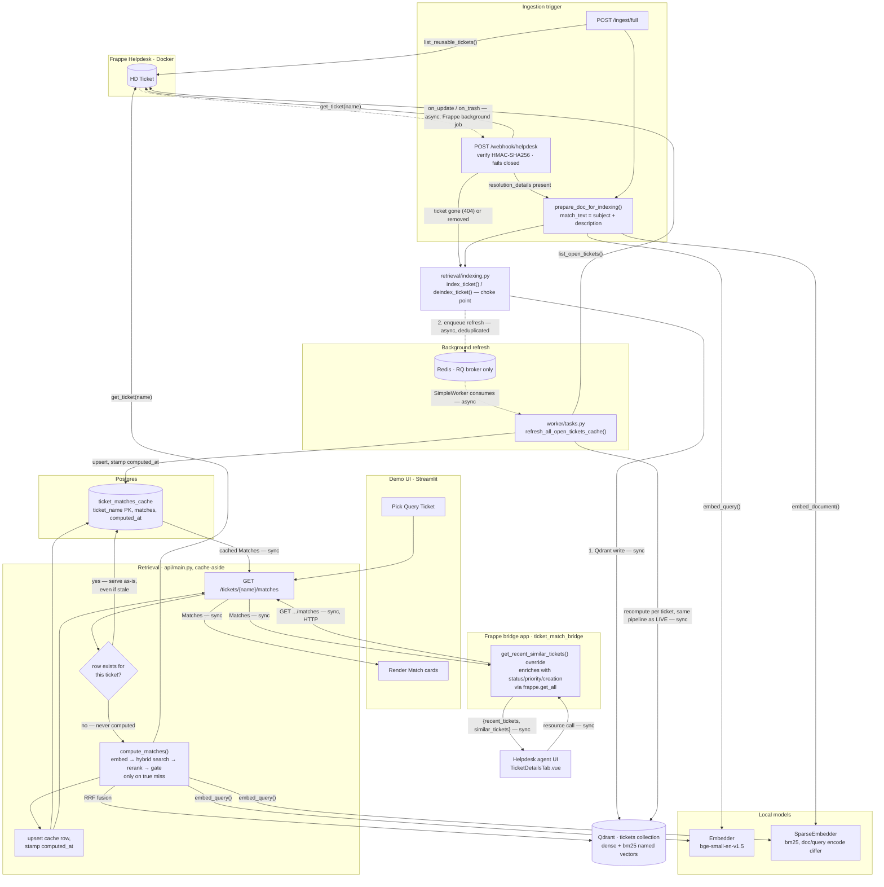

# Architecture

This document shows the pipeline as it is implemented today. See [CONTEXT.md](../CONTEXT.md) for the domain model (Ticket, Match, Match Threshold, and so on) and the `docs/adr/` directory for the decisions behind each part — including [PROPOSED_ARCHITECTURE.md](PROPOSED_ARCHITECTURE.md)'s history, now that every piece it once proposed is implemented.

## Overview

Every Qdrant index mutation goes through one choke point, which also triggers a background refresh of the Postgres Match cache. Reads are cache-aside: a request is served from the cache if a row exists, however old it is (ADR 0007), and only runs the live pipeline on a true miss.

Solid arrows are synchronous: the caller blocks until it gets a response. Dashed arrows are the two asynchronous boundaries in the system: Frappe's own webhook dispatch (queued on Frappe's background job, decoupled from the request that saved the ticket), and the RQ refresh job (`index_ticket()`/`deindex_ticket()` enqueue and return immediately; the worker consumes on its own schedule, in its own process).

Indexing keeps Qdrant current and, via the enqueued refresh, keeps the Match cache current. Retrieval only ever reads — from the cache first, from the live pipeline only to populate a ticket's very first cache row. There is no generation step anywhere in the pipeline. A Match is a past Ticket Record surfaced as-is, not a generated answer.

Two consumers hit the identical cache-backed endpoint: the standalone demo UI, and Helpdesk's own agent ticket view via a small Frappe app (`frappe_bridge/ticket_match_bridge/`) that overrides Helpdesk's stubbed `get_recent_similar_tickets()`. Neither is stale relative to the other, and nothing about retrieval, the cache, or the worker changes for the second consumer — see [Helpdesk-native UI](#helpdesk-native-ui) below.

## Pipeline

Three dashed edges, three asynchronous hops: Frappe's webhook dispatch (unchanged, its own background job); `index_ticket()`/`deindex_ticket()` enqueueing a refresh job, deduplicated so a burst of index mutations collapses into one pending job; and the RQ worker consuming that job on its own schedule, in its own process. Every other edge, including both branches inside `GET /tickets/{name}/matches`, is synchronous.

Note that every route in `api/main.py` is still declared `async def`, but almost none of them `await` anything — `requests`, `sentence-transformers`, `qdrant-client`, and `psycopg2` are all synchronous libraries. A cache-hit request is a single fast Postgres lookup; a cache-miss request still blocks the process for the full live-pipeline duration (embed, search, rerank), same as before this cache existed. `async def` here is a FastAPI convention, not a concurrency guarantee.

### Ingestion and the indexing choke point

Two entry points trigger an index mutation, and both go through the same choke point now. `POST /ingest/full` (`api/main.py`) walks every Reusable Ticket. A ticket is eligible once `resolution_details` is non-empty, independent of the `status` field (ADR 0001). `POST /webhook/helpdesk` (`ingestion/webhook_handler.py`) keeps the index current between full syncs — Frappe fires `on_update` and `on_trash` on the HD Ticket doctype, the handler verifies an HMAC-SHA256 signature and fails closed if `WEBHOOK_SECRET` is unset, refetches the ticket, and re-indexes only if still eligible.

Both call `index_ticket()` / `deindex_ticket()` (`retrieval/indexing.py`, ADR 0006) instead of touching `VectorStore` directly. Each does the Qdrant write, then enqueues a refresh job — deduplicated via a fixed RQ `job_id`, so a burst of webhook events collapses into one pending sweep rather than stacking redundant jobs.

`match_text()` (`ingestion/embedder.py`) is the one place title and description join into the text that gets embedded — for both indexing and querying, and for both the live pipeline and the worker's recompute. The Resolution Summary is never part of the match vector; it is only shown alongside a Match. Point IDs are deterministic (`uuid5` of the ticket name), so every upsert overwrites the same point and indexing stays idempotent.

### Match cache and background refresh

`GET /tickets/{name}/matches` is cache-aside (`api/main.py`, `db/cache.py`). A `ticket_matches_cache` row is served unconditionally once it exists — no freshness check, per ADR 0007. Only a true miss (no row has ever been written for that `ticket_name`) runs the live pipeline (`retrieval/matching.py`'s `compute_matches()`) and writes the result into the cache before returning it.

`worker/tasks.py`'s `refresh_all_open_tickets_cache()` is what keeps cached rows from going stale in practice: on every index mutation, it recomputes Matches for every currently-open ticket and upserts the cache, using the exact same `compute_matches()` the live-miss path uses — a newly-resolved ticket can become a better Match for any open ticket, not a fixed subset, so this is a full sweep rather than targeted invalidation. `worker/run.py` runs it via RQ's `SimpleWorker` (not the default forking `Worker`) specifically so the embedding and reranker models stay loaded across jobs instead of reloading on every refresh.

Staleness is accepted, not bounded — there is no version check and no time-based refresh; a cached row is only as fresh as the last time some corpus change happened to trigger a sweep. See ADR 0007 for the full reasoning.

### Retrieval and the gate

A query embeds the same way a document does, both dense and sparse. Qdrant fuses the two candidate sets with RRF fusion before the cross-encoder sees them (`retrieval/vector_store.py`). Fusion rank builds the candidate pool. It is not a cross-query-comparable confidence value.

The Match Threshold gates on the reranker's score instead (`retrieval/reranker.py`, `config.py`). The threshold is calibrated against the seeded corpus, optimizing F0.5 (`scripts/calibrate_threshold.py`). Below the threshold, the panel shows fewer than five Matches, or none. It never shows a low-confidence Match just to fill the row. This gate applies identically whether a Match comes from a live compute or from a cached row — the worker's sweep runs the same `compute_matches()`, threshold and all.

### Helpdesk-native UI

Helpdesk ships a "Recent / Similar Tickets" section end-to-end in its own frontend — the Vue component, the `useTicket.ts` composable's `recentSimilarTickets` resource, the `{recent_tickets, similar_tickets}` contract — but its backend, `get_recent_similar_tickets()`, hardcodes `similar_tickets = []`. `frappe_bridge/ticket_match_bridge/` overrides that one whitelisted method via Frappe's `override_whitelisted_methods` hook (ADR 0006). The override reuses Helpdesk's own `get_recent_tickets()` unchanged for the `recent_tickets` half, and for `similar_tickets` calls this project's own `GET /tickets/{ticket_name}/matches` — the same cache-aside endpoint the demo UI calls — then enriches each Match with `status`/`priority`/`creation` via one `frappe.get_all` call. Those three fields are Frappe-owned ticket metadata the retrieval API has no reason to know about (CONTEXT.md: Match); `resolution_details` comes back as HTML from the API and is stripped to plain text (`frappe.utils.strip_html_tags`) before reaching the frontend, since the Vue list item renders it as a plain-text snippet, not HTML.

A failure calling this project's API (down, timeout) is caught and logged, returning an empty `similar_tickets` list rather than a 500 — a hiccup in retrieval degrades this one panel, not the whole ticket view. The one Vue change is a single added paragraph in `TicketDetailsTab.vue`'s list-item template showing the resolution snippet, gated on the field being present — without it, an agent still has to open the matched ticket to see the fix, defeating CONTEXT.md's actual point.

This app's source lives in its own repo, [`arunjoyt/ticket-match-bridge`](https://github.com/arunjoyt/ticket-match-bridge) — split out from this monorepo (ADR 0008) once it turned out `bench get-app`'s failure against a local path (noted in ADR 0006's Verification section) wasn't a bench-version quirk but the actual root cause: `bench get-app` clones a git repo, and a subfolder sharing this monorepo's `.git` isn't one. Installed the standard way: `bench get-app https://github.com/arunjoyt/ticket-match-bridge && bench --site <site> install-app ticket_match_bridge`. The Vue edit itself lives inside the Helpdesk app's own source, which is not part of this repo — `frappe_bridge/helpdesk-vue-patch/` keeps a durable copy of the two edited files so the change survives even if the dev instance is recreated.

## Key files

| Concern | File |
| --- | --- |
| API routes, app lifecycle | `api/main.py` |
| Shared retrieve → rerank → filter pipeline, pipeline object graph | `retrieval/matching.py` |
| Index mutation choke point, deduplicated refresh enqueue | `retrieval/indexing.py` |
| Helpdesk REST client | `ingestion/helpdesk_client.py` |
| Dense + sparse embedding, `match_text()` | `ingestion/embedder.py` |
| Webhook signature check, incremental re-index | `ingestion/webhook_handler.py` |
| Dense + sparse fusion query | `retrieval/hybrid_search.py` |
| Qdrant collection, upsert, delete | `retrieval/vector_store.py` |
| Cross-encoder rerank | `retrieval/reranker.py` |
| Match cache (Postgres) | `db/cache.py`, `db/schema.sql` |
| Background refresh worker | `worker/tasks.py`, `worker/run.py` |
| Helpdesk-native UI bridge | [`ticket-match-bridge`](https://github.com/arunjoyt/ticket-match-bridge) (separate repo), `frappe_bridge/helpdesk-vue-patch/` |
| Demo UI | `ui/app.py` |
| Model names, Match Threshold, URLs, `DATABASE_URL`/`REDIS_URL` | `config.py` |
