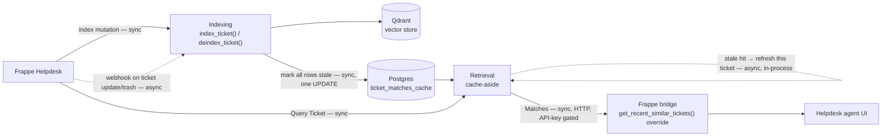
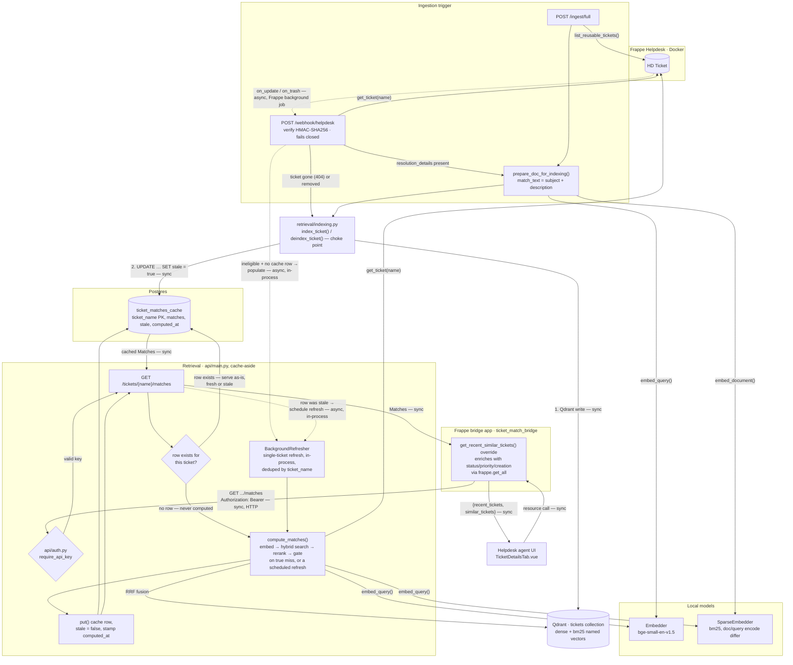

# Architecture

This document shows the pipeline as it is implemented today. See [CONTEXT.md](../CONTEXT.md) for the domain model (Ticket, Match, Match Threshold, and so on) and the `docs/adr/` directory for the decisions behind each part — including [PROPOSED_ARCHITECTURE.md](PROPOSED_ARCHITECTURE.md)'s history, now that every piece it once proposed is implemented.

## Overview

Every Qdrant index mutation goes through one choke point, which also flags every Match-cache row stale (ADR 0011). Reads are cache-aside: a request is served from the cache whenever a row exists, fresh or stale (ADR 0007), and only runs the live pipeline on a true miss. A read that saw a stale row schedules a single-ticket background refresh so the *next* read of that ticket is fresh.

Solid arrows are synchronous: the caller blocks until it gets a response. Dashed arrows are the two asynchronous boundaries: Frappe's own webhook dispatch (queued on Frappe's background job, decoupled from the request that saved the ticket), and the single-ticket cache refresh (scheduled as a FastAPI background task, run after the response is sent, in the API process — ADR 0011 replaced ADR 0006's separate RQ worker with this).

Indexing keeps Qdrant current and marks the cache stale. Retrieval only ever reads — from the cache first, from the live pipeline only to populate a ticket's very first cache row — and reconciles a stale row lazily, on the read after the one that observed it. There is no generation step anywhere in the pipeline. A Match is a past Ticket Record surfaced as-is, not a generated answer.

The one consumer of this endpoint is Helpdesk's own agent ticket view, via a small Frappe app ([`ticket-match-bridge`](https://github.com/arunjoyt/ticket-match-bridge), ADR 0008) that overrides Helpdesk's stubbed `get_recent_similar_tickets()` — see [Helpdesk-native UI](#helpdesk-native-ui) below. A standalone Streamlit demo UI existed earlier in this project but was retired (ADR 0010) once it was clear its only role was demoing the same endpoint Helpdesk's own agent UI already surfaces.

## Pipeline

Two dashed sources, both asynchronous: Frappe's webhook dispatch (unchanged, its own background job), and the single-ticket cache refresh — scheduled as a FastAPI `BackgroundTask` and run after the response is sent, in the API process, deduplicated by ticket name (ADR 0011). Every other edge, including the stale-serve branch inside `GET /tickets/{name}/matches`, is synchronous — the requester is never blocked on a refresh.

Note that every route in `api/main.py` is still declared `async def`, but almost none of them `await` anything — `requests`, `sentence-transformers`, `qdrant-client`, and `psycopg2` are all synchronous libraries. A cache hit (fresh or stale) is a single fast Postgres lookup; a true-miss request still blocks the event loop for the full live-pipeline duration (embed, search, rerank). A scheduled refresh runs the same pipeline in FastAPI's threadpool, off the request path but contending for CPU with request handling for its ~0.5 s. `async def` here is a FastAPI convention, not a concurrency guarantee. See [docs/PERFORMANCE.md](PERFORMANCE.md) for what this actually costs under concurrent load, measured.

### Ingestion and the indexing choke point

Two entry points trigger an index mutation, and both go through the same choke point now. `POST /ingest/full` (`api/main.py`) walks every Reusable Ticket. A ticket is eligible once `resolution_details` is non-empty, independent of the `status` field (ADR 0001). `POST /webhook/helpdesk` (`ingestion/webhook_handler.py`) keeps the index current between full syncs — Frappe fires `on_update` and `on_trash` on the HD Ticket doctype, the handler verifies an HMAC-SHA256 signature and fails closed if `WEBHOOK_SECRET` is unset, refetches the ticket, and re-indexes only if still eligible.

Both call `index_ticket()` / `deindex_ticket()` (`retrieval/indexing.py`, ADR 0006/0011) instead of touching `VectorStore` directly. `index_ticket()` does the Qdrant upsert then `cache.mark_all_stale()`; `deindex_ticket()` deletes the ticket's one point and marks the cache stale only if a point was actually there (`VectorStore.delete_by_ticket_name` reports this), so a webhook for a never-indexed Query Ticket doesn't needlessly invalidate the cache. The upsert overwrites the ticket's deterministic point, so the eligible path skips a delete-first.

`match_text()` (`ingestion/embedder.py`) is the one place title and description join into the text that gets embedded — for both indexing and querying, and for both the live pipeline and a scheduled refresh. The Resolution Summary is never part of the match vector; it is only shown alongside a Match. Point IDs are deterministic (`uuid5` of the ticket name), so every upsert overwrites the same point and indexing stays idempotent.

### Match cache and lazy revalidation

`GET /tickets/{name}/matches` is cache-aside (`api/main.py`, `db/cache.py`). A `ticket_matches_cache` row is served whenever it exists, fresh or stale — no freshness check gates the response (ADR 0007). A true miss (no row ever written for that `ticket_name`) runs the live pipeline (`retrieval/matching.py`'s `compute_matches()`) and writes the result into the cache before returning it.

Staleness is reconciled lazily, one ticket at a time, driven by reads (ADR 0011). An index mutation flips every row's `stale` flag with a single `UPDATE` — it does not recompute anything. When a read hits a stale row, it serves that row as-is and schedules a single-ticket refresh via `BackgroundRefresher` (`api/refresh.py`): a FastAPI background task, run after the response in the API process, that reruns the same `compute_matches()` and `put()`s the result with `stale = false`. The reader who triggered the refresh still saw the stale row; the *next* read of that ticket sees fresh Matches. An in-process set keyed by ticket name collapses concurrent reads of the same stale ticket into one refresh.

There is no sweep and no timer. A row for a ticket nobody opens stays stale indefinitely, harmlessly — nothing reads it. The webhook handler covers the one gap this leaves: a brand-new Query Ticket (ineligible, no cache row) gets a single-ticket populate scheduled the same way, so the first agent to open it gets a cache hit rather than a cold live compute. See ADR 0011 for the full reasoning and the costs accepted (chiefly: the agent who opens a related ticket immediately after resolving one sees stale Matches until their next open).

### API-key auth

`POST /ingest/full` and `GET /tickets/{name}/matches` require `Authorization: Bearer <API_KEY>` (`api/auth.py`, ADR 0009). Every caller of this API is a trusted backend or operator, not an individual end user with a login — the Frappe bridge app, and whoever runs `/ingest/full` by hand — so a single shared key checked with `hmac.compare_digest` matches the trust model, the same shape as `WEBHOOK_SECRET`'s HMAC check. Fails closed: an unset `API_KEY` rejects every protected request, never falls open. Two routes stay exempt: `GET /health` (uptime checks) and `POST /webhook/helpdesk`, which already has its own HMAC-SHA256 auth and doesn't need a second mechanism layered on top.

### Retrieval and the gate

A query embeds the same way a document does, both dense and sparse. Qdrant fuses the two candidate sets with RRF fusion before the cross-encoder sees them (`retrieval/vector_store.py`). Fusion rank builds the candidate pool. It is not a cross-query-comparable confidence value.

The Match Threshold gates on the reranker's score instead (`retrieval/reranker.py`, `config.py`). The threshold is calibrated against the seeded corpus, optimizing F0.5 (`scripts/calibrate_threshold.py`). Below the threshold, the panel shows fewer than five Matches, or none. It never shows a low-confidence Match just to fill the row. This gate applies identically whether a Match comes from a true-miss live compute or from a scheduled single-ticket refresh — both run the same `compute_matches()`, threshold and all.

### Helpdesk-native UI

Helpdesk ships a "Recent / Similar Tickets" section end-to-end in its own frontend — the Vue component, the `useTicket.ts` composable's `recentSimilarTickets` resource, the `{recent_tickets, similar_tickets}` contract — but its backend, `get_recent_similar_tickets()`, hardcodes `similar_tickets = []`. `frappe_bridge/ticket_match_bridge/` overrides that one whitelisted method via Frappe's `override_whitelisted_methods` hook (ADR 0006). The override reuses Helpdesk's own `get_recent_tickets()` unchanged for the `recent_tickets` half, and for `similar_tickets` calls this project's own `GET /tickets/{ticket_name}/matches`, `Authorization` header included — then enriches each Match with `status`/`priority`/`creation` via one `frappe.get_all` call. Those three fields are Frappe-owned ticket metadata the retrieval API has no reason to know about (CONTEXT.md: Match); `resolution_details` comes back as HTML from the API and is stripped to plain text (`frappe.utils.strip_html_tags`) before reaching the frontend, since the Vue list item renders it as a plain-text snippet, not HTML.

A failure calling this project's API (down, timeout) is caught and logged, returning an empty `similar_tickets` list rather than a 500 — a hiccup in retrieval degrades this one panel, not the whole ticket view. The one Vue change is a single added paragraph in `TicketDetailsTab.vue`'s list-item template showing the resolution snippet, gated on the field being present — without it, an agent still has to open the matched ticket to see the fix, defeating CONTEXT.md's actual point.

This app's source lives in its own repo, [`arunjoyt/ticket-match-bridge`](https://github.com/arunjoyt/ticket-match-bridge) — split out from this monorepo (ADR 0008) once it turned out `bench get-app`'s failure against a local path (noted in ADR 0006's Verification section) wasn't a bench-version quirk but the actual root cause: `bench get-app` clones a git repo, and a subfolder sharing this monorepo's `.git` isn't one. Installed the standard way: `bench get-app https://github.com/arunjoyt/ticket-match-bridge && bench --site <site> install-app ticket_match_bridge`. The Vue edit itself lives inside the Helpdesk app's own source, which is not part of this repo — `frappe_bridge/helpdesk-vue-patch/` keeps a durable copy of the two edited files so the change survives even if the dev instance is recreated.

## Key files

| Concern | File |
| --- | --- |
| API routes, app lifecycle | `api/main.py` |
| API-key auth | `api/auth.py` |
| Shared retrieve → rerank → filter pipeline, single-ticket refresh | `retrieval/matching.py` |
| Index mutation choke point (Qdrant write + `mark_all_stale()`) | `retrieval/indexing.py` |
| Helpdesk REST client | `ingestion/helpdesk_client.py` |
| Dense + sparse embedding, `match_text()` | `ingestion/embedder.py` |
| Webhook signature check, incremental re-index | `ingestion/webhook_handler.py` |
| Dense + sparse fusion query | `retrieval/hybrid_search.py` |
| Qdrant collection, upsert, delete | `retrieval/vector_store.py` |
| Cross-encoder rerank | `retrieval/reranker.py` |
| Match cache (Postgres), `stale` flag | `db/cache.py`, `db/schema.sql` |
| In-process single-ticket background refresh, dedup | `api/refresh.py` |
| Helpdesk-native UI bridge | [`ticket-match-bridge`](https://github.com/arunjoyt/ticket-match-bridge) (separate repo), `frappe_bridge/helpdesk-vue-patch/` |
| Model names, Match Threshold, URLs, `DATABASE_URL`/`API_KEY` | `config.py` |
