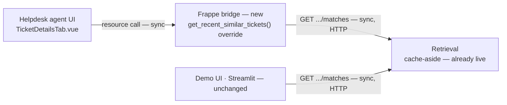

# Proposed Architecture: Helpdesk-native UI

**Status: proposed, not yet implemented.** This document shows the one remaining piece of [ADR 0006](adr/0006-background-compute-and-helpdesk-integration.md) — serving Matches inside Helpdesk's own agent UI. Everything else ADR 0006 proposed (the Postgres cache, the RQ worker, the `retrieval/indexing.py` choke point) is implemented and described in [ARCHITECTURE.md](ARCHITECTURE.md) as the current system.

The change in one sentence: `GET /tickets/{name}/matches` is already a fast, cache-backed endpoint (ARCHITECTURE.md) with one consumer, the standalone demo UI. This proposal adds a second consumer — Helpdesk's own ticket view — by overriding a backend method Helpdesk ships as an unfinished stub, with zero changes to the retrieval pipeline itself.

## Overview

Both consumers hit the identical cache-backed endpoint (ARCHITECTURE.md's `GET /tickets/{name}/matches`) — neither is stale relative to the other, and nothing about the retrieval pipeline, the cache, or the worker changes for this piece.

## What it does

Frappe Helpdesk already ships a "Recent / Similar Tickets" section in its real agent ticket view — the Vue component, the `useTicket.ts` composable's `recentSimilarTickets` resource, and the backend contract (`{recent_tickets: [...], similar_tickets: [...]}`, each item needing `subject`, `creation`, `name`, `status`) are all wired end-to-end. It's never been finished: `helpdesk/helpdesk/doctype/hd_ticket/api.py`'s `get_recent_similar_tickets()` hardcodes `similar_tickets = []`.

A small new Frappe app (`frappe_bridge/ticket_match_bridge/`), installed onto the Helpdesk bench, overrides that one whitelisted method via `override_whitelisted_methods`. The override calls this project's own `GET /tickets/{ticket_name}/matches` over HTTP — the same endpoint the demo UI already calls — and reshapes the response into the `{recent_tickets, similar_tickets}` contract the already-built frontend expects.

**One scoped Vue edit.** The existing stub's list-item template renders only `subject`, `creation`, `status` — no room for the resolution text. Showing a Match without its resolution would defeat the whole point of this system (CONTEXT.md: "the agent never opens the original ticket to find the fix"). This is the one deliberate exception to "zero Vue changes": one added line in the list-item template, bound to a field the override already provides.

## Why this doesn't touch the retrieval pipeline

This is a materially smaller change than it might sound, because the expensive part is already built and already fast. Before the cache existed, embedding a multi-second live-pipeline call inside a Frappe request would have made the agent's own ticket view feel slow — that's what made this piece worth deferring until the cache-aside work (ARCHITECTURE.md) landed. Now that `GET /tickets/{name}/matches` is a cache-hit-fast endpoint for any ticket the worker has already swept, wiring a second consumer to it is close to filling in a documented gap in Helpdesk's own stub, not building new retrieval infrastructure.

## New and changed files

| Concern | File |
| --- | --- |
| Frappe method override | `frappe_bridge/ticket_match_bridge/` |
| Resolution snippet line | Helpdesk's `TicketDetailsTab.vue` list-item template (one line) |

Not addressed by this proposal: API authentication (tracked separately as issue #7, more relevant now that a second external caller exists) and production wiring of the Helpdesk-bridge-to-API path (`DEPLOYMENT_PLAN.md`, same local-dev-only caveat as ADR 0005's `host.docker.internal`).
