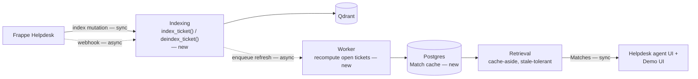
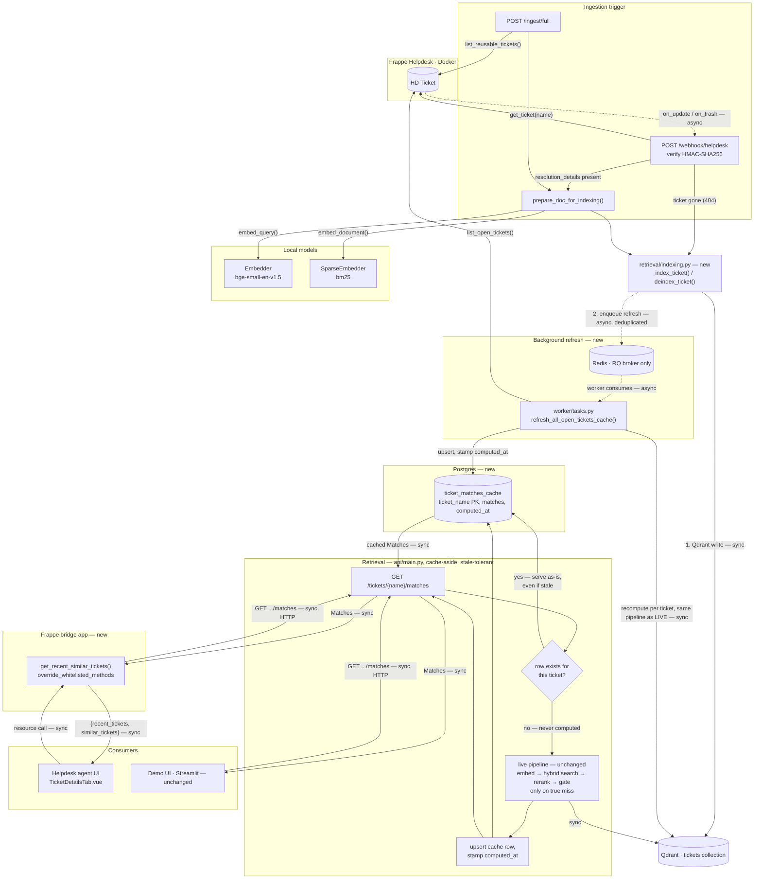

# Proposed Architecture: Background Compute

**Status: proposed, not yet implemented.** This document shows the design from [ADR 0006](adr/0006-background-compute-and-helpdesk-integration.md), not the current system. See [ARCHITECTURE.md](ARCHITECTURE.md) for what is live today, and ADR 0006 for the full reasoning behind each decision below.

The change in one sentence: today, `GET /tickets/{name}/matches` runs the full retrieval pipeline on every call. This proposal precomputes Matches in a background worker, caches them in Postgres, and serves both the demo UI and Helpdesk's own agent UI from that cache.

**One deliberate revision from ADR 0006:** the ADR gates reads on a `corpus_version` counter, falling back to the live pipeline on any stale or missing cache entry. This document drops that gate, per [ADR 0007](adr/0007-accept-match-cache-staleness.md) — see [Accepting staleness](#accepting-staleness) below for what changed and why. Everything else in ADR 0006 stands as written.

## Overview

Solid arrows are synchronous, dashed are asynchronous — same convention as [ARCHITECTURE.md](ARCHITECTURE.md). Two async boundaries exist in this design, both decoupled from whatever request triggered them: Frappe's webhook dispatch (unchanged from today), and the new background refresh — indexing enqueues a job and returns immediately, the worker picks it up on its own schedule.

Every index mutation now goes through one choke point (`retrieval/indexing.py`) instead of calling `VectorStore` directly, so the refresh signal can never be forgotten at a call site.

## Pipeline

Three dashed edges, three asynchronous hops:

1. `HD Ticket -> POST /webhook/helpdesk` — Frappe's own background job, unchanged from today.
2. `index_ticket() -> Redis queue` — the indexing choke point enqueues a refresh job and returns. It does not wait for the recompute.
3. `Redis queue -> worker` — the RQ worker consumes jobs on its own schedule, in its own process.

Every other edge, including both cache-aside branches inside `GET /tickets/{name}/matches`, is synchronous. If a row exists for the ticket, it is served as-is — however old it is, with no freshness check. Only a true miss (no row has ever been written for this `ticket_name`) falls back to the live pipeline documented in [ARCHITECTURE.md](ARCHITECTURE.md) — same embed, hybrid search, rerank, and Match Threshold gate — which then writes the result into the cache before returning it. The worker is a genuinely separate process, unlike the current API's `async def` routes: recomputation there does not block a single request anywhere.

## Accepting staleness

See [ADR 0007](adr/0007-accept-match-cache-staleness.md) for the full decision record. ADR 0006 gates every read on a `corpus_version` counter: a cached row is only served when its version matches the index's current version, and anything stale or missing falls back to the live pipeline. This document drops that gate. A cache hit is served unconditionally, no matter how old it is. The live pipeline runs only when a ticket has no cached row at all.

**Why this is a real simplification, not just a smaller diagram.** The `corpus_version` table and the version comparison existed for one reason — deciding whether to trust a cached row. Once reads stop making that decision, the table has no reader left, so it comes out of the schema entirely. `ticket_matches_cache` keeps `computed_at` for observability (how old is this row), but nothing branches on it.

**What this trades away.** Staleness is no longer bounded by a version check — it is now unbounded and silent. If the worker falls behind, crashes, or the queue backs up, agents see Matches computed against an old corpus indefinitely, with no signal that anything is wrong. There is also no time-based refresh anywhere in this design: the worker only runs when a corpus-changing event fires, so staleness is bounded by "whenever the next unrelated resolution happens to trigger a sweep," not by a clock.

**Why the live fallback stays for a true miss, and does not stay for staleness.** The fallback does two jobs in ADR 0006's design: it is the freshness safety net, and it is also what puts a row in the cache the first time — `UPSERT` writes the row that `LOOKUP` will find on every later read. The worker's sweep only covers whatever `list_open_tickets()` returns when a *resolution* triggers it; a ticket created since the last sweep is not in that list yet. Drop the fallback entirely, and a brand-new open ticket shows no Matches until some unrelated resolution happens to trigger the next sweep. Keeping the fallback for a true miss preserves that on-demand cache-warming behavior while still accepting staleness everywhere the ADR's version gate used to prevent it. The first read for a never-computed ticket pays full pipeline cost, same as today's system; every read after that is a cache hit.

## What changes versus today

| | Today | Proposed |
| --- | --- | --- |
| Read path | Runs the full pipeline on every request | Cache-aside: serves a cached entry as-is if one exists, regardless of age; runs the live pipeline only when none exists yet |
| Index mutation | `VectorStore` called directly from two places | One choke point (`index_ticket()` / `deindex_ticket()`), also enqueues a refresh |
| Refresh | None — a cache does not exist yet | RQ worker recomputes every open ticket's Matches after each corpus change, deduplicated |
| Helpdesk agent view | Not implemented — the stub hardcodes `similar_tickets = []` | Served by a Frappe app overriding the existing stub, reusing the same cache-backed endpoint |
| Demo UI | Calls the live pipeline directly | Unchanged code, now calls the cache-backed endpoint transparently |

A cache entry is served unconditionally once it exists — no version check, no staleness bound. The live pipeline runs only to populate a ticket's very first entry; see [Accepting staleness](#accepting-staleness).

## Tradeoffs

| Dimension | Today: compute-on-read | Proposed: cache-aside + worker |
| --- | --- | --- |
| Read latency | Every call pays full cost: dense + sparse embed, Qdrant RRF query, cross-encoder rerank over ~20 candidates. | A cache hit is one Postgres lookup. Fast, consistently, on the common path. |
| Concurrency | Every route in `api/main.py` is `async def`, but the work inside is blocking (`requests`, `sentence-transformers`, `qdrant-client`). A request blocks the process for its full duration. | The expensive work moves to a separate worker process, off the request path entirely. |
| Freshness vs. correctness | Always exact — computed from the live index, so staleness cannot happen. | Staleness is accepted, not gated: a cache hit is served as-is regardless of age, bounded only by "whenever the next unrelated resolution triggers a worker sweep," not by a clock. |
| Wasted compute | Recomputes from scratch even for a ticket nobody's data changed since the last identical query. | Computed once per corpus change per ticket, reused across every reader until the next sweep. |
| Operational surface | One service, no new failure modes. | Two new services (Postgres, Redis) plus a worker process — a schema to manage, a queue that can back up, a worker that can crash or fall behind, silently. |
| Blast radius of a bug | A bug shows up immediately, one request at a time. | The worker being late, crashed, or backlogged shows up nowhere — agents keep seeing old Matches with no signal anything is stale. There is no version check left to catch it. |
| Scaling shape | Cost scales with request volume × rerank cost. Corpus size (indexed Reusable Tickets) barely matters — Qdrant's ANN search is sublinear, and the candidate pool handed to the reranker is capped at `CANDIDATE_POOL_SIZE = 20` regardless of corpus size. | Refresh cost scales with open-ticket count × how often the corpus changes — `refresh_all_open_tickets_cache()` reruns the full pipeline for every open ticket on every single index mutation. This is a different cost axis than corpus size, one the current design never pays at all, because it only ever computes for the one ticket someone is actively viewing. |
| Enables Helpdesk-native UI | Awkward — embedding a multi-second pipeline call inside a Frappe request would make the agent's own ticket view feel slow. | Makes it viable — Helpdesk's UI hits the same fast cache-backed endpoint the demo UI does. |
| Build cost | Already built, already working. | New schema, new choke-point module, new task, new Frappe app — real work before any benefit lands. |

The core tradeoff: the proposed design pays compute ahead of demand (recomputes every open ticket's Matches speculatively, on every corpus change) to make reads cheap. The current design pays exactly on demand, for exactly the ticket someone asked about, and never more — at the cost of every read being slow and requests serializing behind each other under concurrent load.

## New and changed files

| Concern | File |
| --- | --- |
| Index mutation choke point | `retrieval/indexing.py` |
| Cache schema (`ticket_matches_cache` only — no version table) | `db/schema.sql` |
| Background refresh task | `worker/tasks.py`, `worker/run.py` |
| Frappe method override | `frappe_bridge/ticket_match_bridge/` |
| Cache-aside branch | `api/main.py`'s `get_matches` |
| New services | `postgres`, `redis`, `worker` in `docker-compose.yml` |
| New config | `DATABASE_URL`, `REDIS_URL` |
| New dependencies | `rq`, `psycopg2-binary` |

Not addressed by this proposal: API authentication (tracked separately as issue #7) and production wiring of the Helpdesk-bridge-to-API path (`DEPLOYMENT_PLAN.md`).
